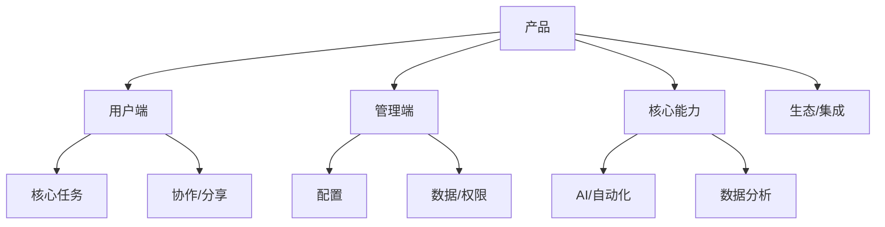
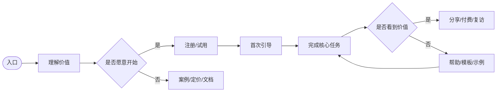
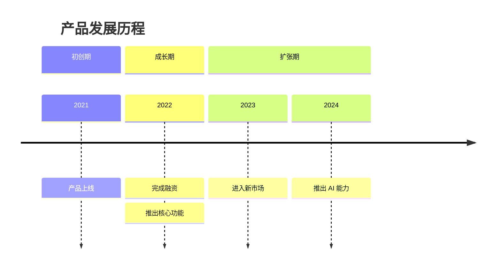
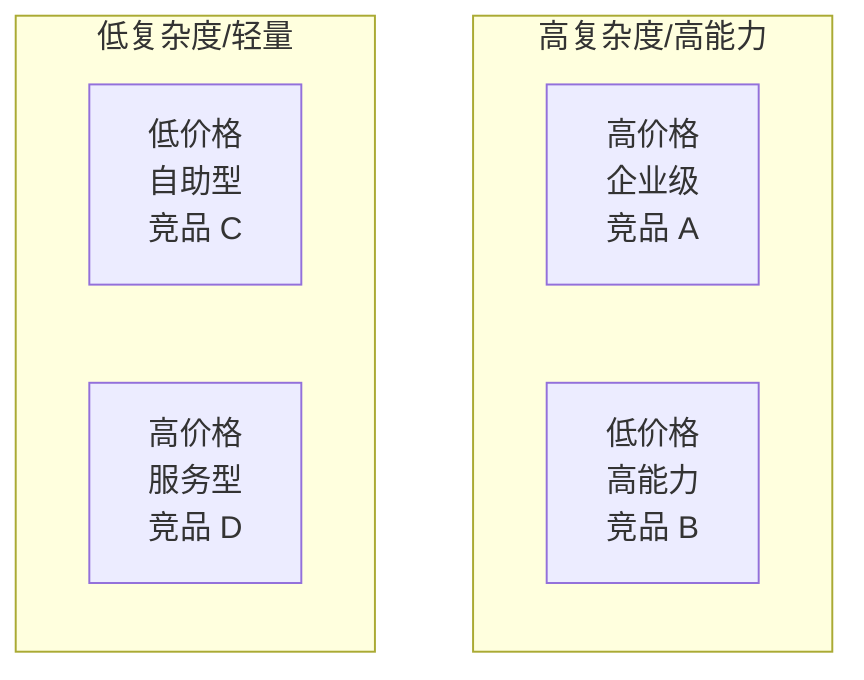
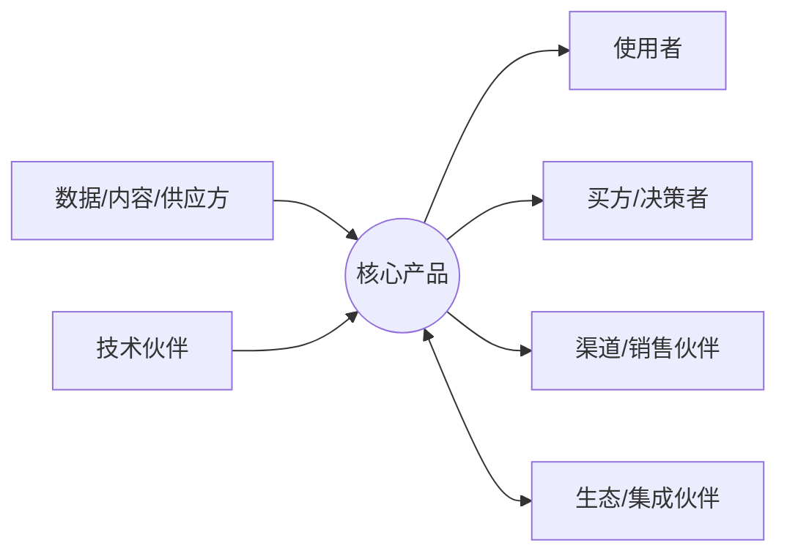
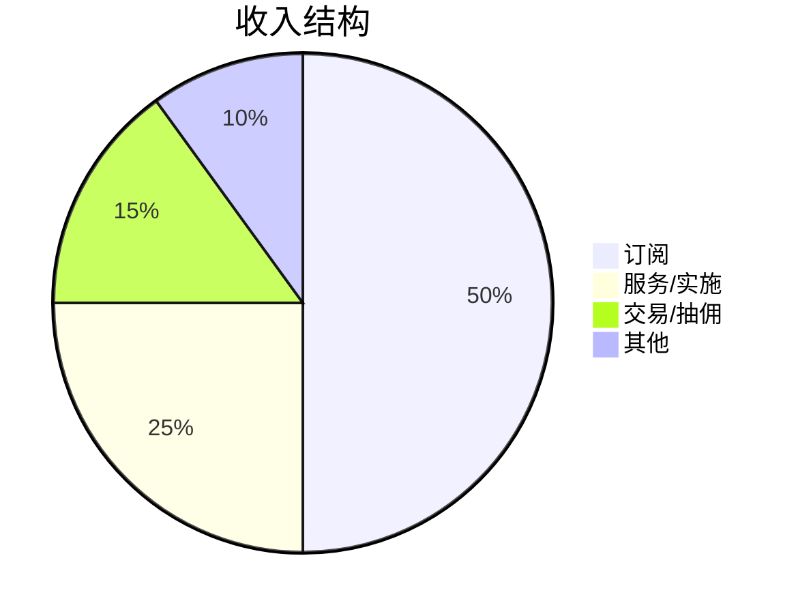
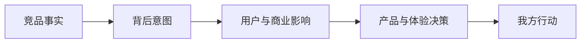

# 可视化图表规范

图表用于压缩信息和辅助判断，不用于装饰。信息不足时跳过图表。

使用图表前先确认它承担的阅读任务：

- **结构关系**：用产品架构图、生态关系图。
- **过程路径**：用用户核心流程图、决策链路图。
- **时间变化**：用发展历程时间线。
- **位置差异**：用竞争定位图。
- **比例构成**：用收入结构图，但必须有数据或明确估算依据。
- **多维能力比较**：用能力雷达或文本条形图，但评分必须来自证据。

图表使用原则：

- 每个图表都必须支持一个明确判断，不为了“显得专业”而画图。
- 图表前后必须有相邻解释，说明它在回答什么问题、如何阅读、对产品与体验决策意味着什么。
- 图表标题只负责命名，不替代分析结论。
- 同一信息不要同时用表格和图表重复展示，除非二者承担不同任务。
- 信息不足、坐标轴牵强、数据无法解释时，宁可用段落或表格，不要画图。
- 如果 Mermaid 表达会让信息变复杂，优先使用清晰的 Markdown 表格、文本路径或短段落。

## 目录

1. 产品架构图
2. 用户核心流程图
3. 发展历程时间线
4. 竞争定位图
5. 商业模式/生态关系图
6. 收入结构图
7. 功能能力雷达
8. 产品与体验决策链路图

## 1. 产品架构图

用于展示产品矩阵、模块层次和能力关系。



图后必须说明：这个结构反映了什么产品策略，哪些模块支撑差异化。

## 2. 用户核心流程图

用于展示注册、首次价值、核心任务、付费转化等路径。



图后说明：摩擦点在哪里，设计如何影响激活、转化或留存。

## 3. 发展历程时间线

用于展示公司、产品、融资、重大功能和战略转型。



如果渲染器不支持 timeline，用表格替代。

## 4. 竞争定位图

用于二维展示竞品定位差异。坐标轴必须根据行业选择。



常用坐标轴：

- 功能丰富度 vs 定价水平
- 自助程度 vs 销售服务深度
- 专业深度 vs 易用性
- 平台化程度 vs 垂直场景深度
- 品牌感性表达 vs 工具效率表达

## 5. 商业模式/生态关系图

用于展示上下游、伙伴、渠道、用户和核心产品关系。



图后说明：生态结构如何影响产品边界、功能开放和体验复杂度。

## 6. 收入结构图

仅在有数据或有明确依据的预估时使用。



如果是预估，必须标注依据和不确定性。

## 7. 功能能力雷达

Mermaid 不原生支持雷达图，可用文本条形图。

```text
能力对比（1-5 分）

              竞品A  竞品B  竞品C
功能广度      ████   ███    █████
核心深度      █████  ████   ███
易用性        ███    █████  ████
转化设计      ████   ███    █████
生态开放      ██     ████   ███

评分必须来自前文证据，不凭空打分。
```

## 8. 产品与体验决策链路图

用于展示从事实到行动的推理链。



适合放在结论章节或关键发现章节，帮助读者理解为什么建议这样做。
